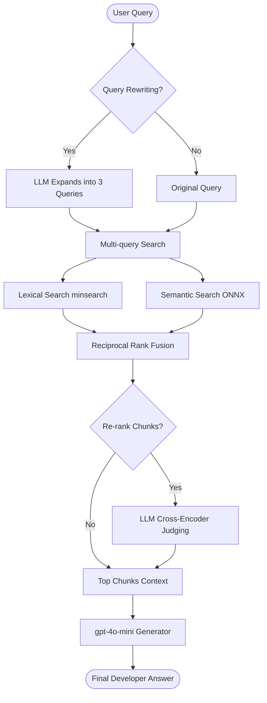

# ⚡ FastAPI Developer QA Assistant (Advanced RAG)

An end-to-end Retrieval-Augmented Generation (RAG) assistant designed to help developers write FastAPI applications faster by providing context-aware, accurate explanations and code samples directly from the official FastAPI English documentation.

---

## 📋 Problem Description

FastAPI is a modern, high-performance web framework. While its documentation is incredibly comprehensive, finding specific code examples, middleware configurations, or advanced dependency overrides can require navigating multiple pages and search results.

This project solves this by index-searching all English FastAPI documentation pages, embedding them into a local vector database, and using an LLM to generate precise answers to technical developer questions.

### RAG & Agent Flow Architecture


---

## 🛠️ Technologies Used

* **LLM Engine:** OpenAI `gpt-4o-mini`
* **Embeddings:** ONNX runtime (`Xenova/all-MiniLM-L6-v2`) — a lightweight, PyTorch-free embedder running locally on CPU.
* **Knowledge Base:** 
  * **Vector Database:** In-process multi-dimensional cosine similarity indexing via NumPy.
  * **Keyword Search:** `minsearch` (lexical search engine).
  * **Metadata Storage:** `DuckDB` (serverless, analytical local database).
* **Ingestion Pipeline:** `dlt` (Data Load Tool) — automates downloading, normalizing, and inserting documents into DuckDB.
* **User Interface & Monitoring Dashboard:** `Streamlit` with `Plotly`.
* **Logging:** SQLite (`logs.db`).
* **Containerization:** `Docker` & `docker-compose`.

---

## 📈 Evaluation Metrics

### 1. Retrieval Evaluation (`evaluate_retrieval.py`)
We generated a ground truth dataset of technical FastAPI questions mapped to their target files. Evaluating the top 5 results across the three search methods:

| Method | Hit Rate @ 5 | MRR @ 5 |
| :--- | :---: | :---: |
| **TEXT (Lexical)** | 80.00% | 0.6083 |
| **VECTOR (Semantic)** | 80.00% | 0.6458 |
| **HYBRID (RRF)** | **85.00%** | **0.7433** |

*Conclusion: Hybrid search using Reciprocal Rank Fusion (RRF) combines exact keyword matches with semantic meaning, delivering the best Hit Rate and the highest Mean Reciprocal Rank (MRR).*

### 2. LLM Output Evaluation (`evaluate_llm.py`)
We evaluated the output of two different prompts using `gpt-4o-mini` as a judge (scoring 1 to 5):

| Prompt Template | Relevance (1-5) | Completeness (1-5) | Correctness (1-5) |
| :--- | :---: | :---: | :---: |
| **Prompt A** (Concise Factual) | 5.00 | 4.00 | 5.00 |
| **Prompt B** (Detailed Tutorial) | **5.00** | **5.00** | **5.00** |

*Conclusion: Prompt B (Detailed Tutorial) scored higher on completeness by providing step-by-step concepts and copyable code blocks.*

---

## 🚀 Running the Project

### Prerequisites
* Docker & Docker Compose installed.
* An OpenAI API Key.

### Steps to Run

1. **Configure Environment:**
   Create a `.env` file in the **root** `llmzoomcamp/` directory (parent of `project/`) and add your OpenAI key:
   ```env
   OPENAI_API_KEY=your-openai-api-key-here
   ```

2. **Launch with Docker Compose:**
   From the `project/` directory, run:
   ```bash
   docker-compose up --build
   ```

3. **Verify App Startup:**
   During the container build/startup phase, the following steps execute automatically:
   * Downloads the ONNX model files.
   * Runs the `ingest.py` script to fetch, chunk, embed, and load the documentation into the database.
   * Launches the Streamlit app.

4. **Access the Interface:**
   Open [http://localhost:8501](http://localhost:8501) in your browser.

---

## 💡 Advanced RAG Best Practices Implemented

1. **Hybrid Search (RRF):** Merges lexical text search and semantic vector embeddings using Reciprocal Rank Fusion to leverage both exact matches and contextual meaning.
2. **User Query Rewriting:** The system prompts the LLM to expand the user query into 3 separate search queries (covering synonyms and related tech jargon) to improve hit rates.
3. **Document Re-ranking:** A second pass LLM judge evaluates the retrieved context blocks for relevance, sorting them to ensure only the highest-quality references are injected into the final prompt.
4. **Monitoring and Feedback:** Query metadata (response times, token costs, modes) and user feedback (thumbs-up/down) are logged into a local SQLite database, visualized in a live, in-app admin dashboard featuring 5 Plotly charts.
